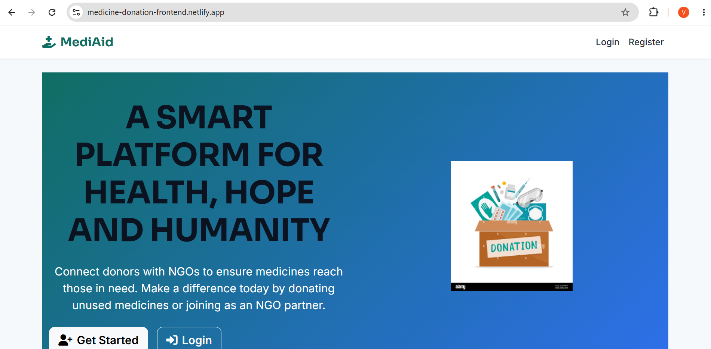
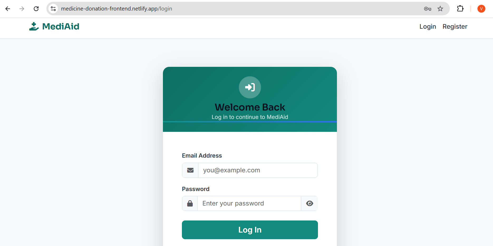
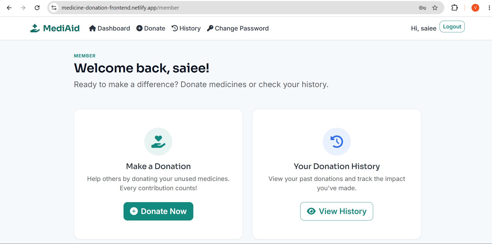
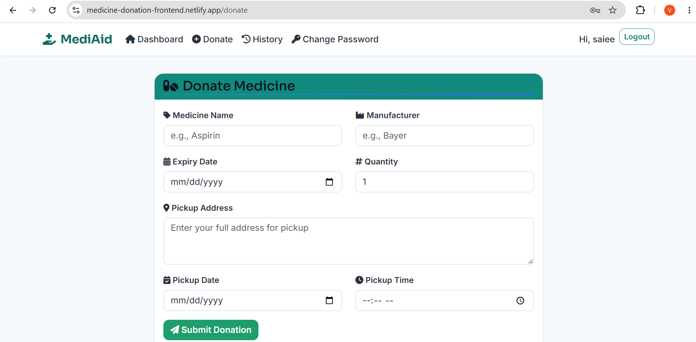
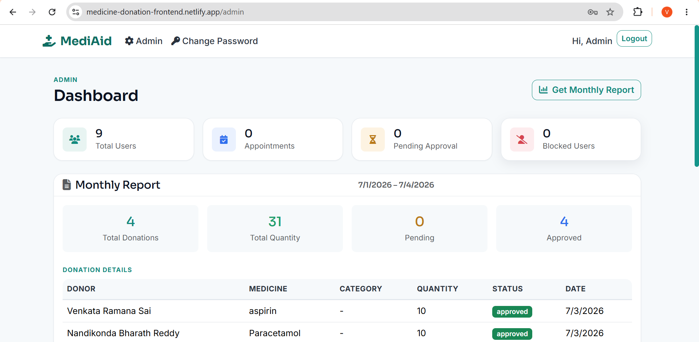
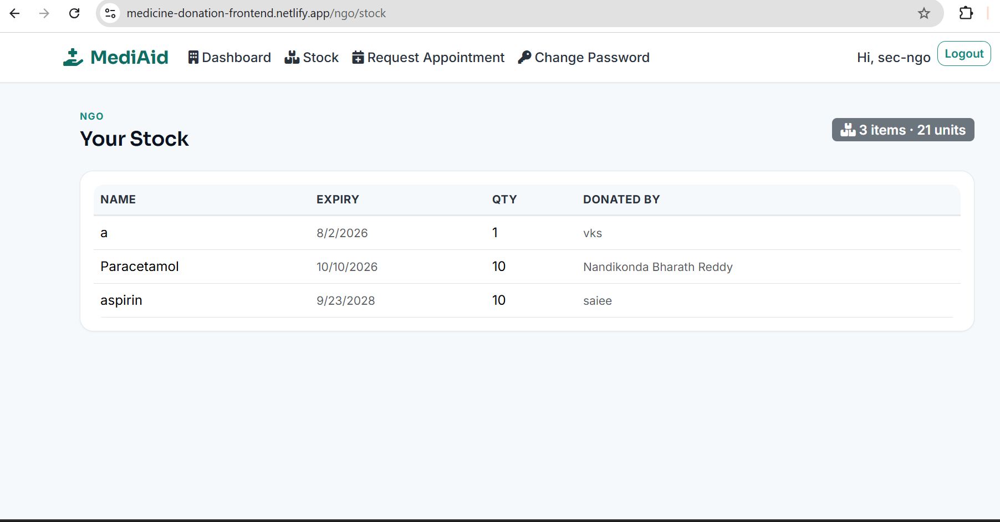

# 💊 MediAid - Medicine Donation Platform

<p align="center">


</p>

A **full-stack MERN (MongoDB, Express.js, React.js, Node.js)** web application that helps reduce medicine wastage by connecting medicine donors, NGOs, and administrators through a secure online platform.

The system enables users to donate unused medicines before they expire, allowing NGOs to verify, manage, and distribute them to people in need while maintaining transparency and efficiency.

---

# 🚀 Live Demo

https://medicine-donation-frontend.netlify.app/


# 📌 Features

## 👤 User Module

- User Registration & Login
- JWT Authentication
- Secure Password Recovery
- Profile Management

## 💊 Medicine Donation

- Donate Medicines
- Upload Medicine Images
- Medicine Verification
- Donation History
- View Available Medicines

## 🏥 NGO Module

- NGO Dashboard
- Manage Inventory
- Receive Assigned Donations
- Appointment Management

## 👨‍💼 Admin Module

- User Management
- NGO Management
- Medicine Verification
- Reports Dashboard
- Delete Medicines
- Platform Monitoring

## 📅 Appointment System

- Book Appointment
- Manage Requests
- Schedule Donations

## 📊 Reports

- Monthly Reports
- Donation Analytics
- Inventory Statistics

## 📧 Notifications

- Email Notifications
- SMS Notifications (Twilio)

---

# 🛠 Tech Stack

## Frontend

- React.js
- React Router DOM
- Axios
- Bootstrap
- Tailwind CSS
- React Toastify
- Font Awesome
- Tesseract.js (OCR)

## Backend

- Node.js
- Express.js
- JWT Authentication
- Multer
- Nodemailer
- Twilio

## Database

- MongoDB
- Mongoose ODM

---

# 📂 Folder Structure

```
medicine-donation-platform-mediaid/

│── backend/
│   ├── config/
│   ├── controllers/
│   ├── middleware/
│   ├── models/
│   ├── routes/
│   ├── uploads/
│   ├── server.js
│   └── package.json
│
│── frontend/
│   ├── public/
│   ├── src/
│   ├── package.json
│   └── tailwind.config.js
│
├── README.md
```

---

# ⚙️ Installation

## 1️⃣ Clone Repository

```bash
git clone https://github.com/vrs2k5/medicine-donation-platform-mediaid.git
```

```bash
cd medicine-donation-platform-mediaid
```

---

## 2️⃣ Backend Setup

```bash
cd backend

npm install
```

Create a `.env` file

```env
PORT=5000

MONGO_URI=YOUR_MONGODB_URI

JWT_SECRET=YOUR_SECRET_KEY

EMAIL_USER=YOUR_EMAIL

EMAIL_PASS=YOUR_EMAIL_PASSWORD

TWILIO_ACCOUNT_SID=YOUR_ACCOUNT_SID

TWILIO_AUTH_TOKEN=YOUR_AUTH_TOKEN

TWILIO_PHONE_NUMBER=YOUR_PHONE_NUMBER
```

Run Backend

```bash
npm start
```

---

## 3️⃣ Frontend Setup

```bash
cd frontend

npm install

npm start
```

Application runs on

Frontend

```
http://localhost:3000
```

Backend

```
http://localhost:5000
```

---

# 🔐 User Roles

| Role | Permissions |
|------|-------------|
| 👤 Member | Register, Login, Donate Medicines, View History |
| 🏥 NGO | Manage Inventory, Receive Donations, Appointment Handling |
| 👨‍💼 Admin | Manage Users, Verify Medicines, Generate Reports |

---

# 📷 Screenshots

> Create a **screenshots** folder and place the following images.

```
screenshots/

home.png

login.png

dashboard.png

donate.png

admin.png

ngo.png
```

## Home



---

## Login



---

## Dashboard



---

## Donate Medicine



---

## Admin Dashboard



---

## NGO Dashboard



---

# 🔄 System Workflow

```
User Registration/Login
            │
            ▼
Donate Medicines
            │
            ▼
Upload Medicine Details
            │
            ▼
OCR Verification
            │
            ▼
Admin Approval
            │
            ▼
NGO Assignment
            │
            ▼
Medicine Distribution
            │
            ▼
Reports & Analytics
```

---

# 🎯 Project Objectives

- Reduce medicine wastage.
- Provide medicines to needy people.
- Digitize medicine donation.
- Improve transparency.
- Connect donors and NGOs.
- Simplify inventory management.

---

# 🌟 Future Enhancements

- AI-based Medicine Expiry Prediction
- Barcode Scanner
- Google Maps Integration
- QR Code Verification
- Push Notifications
- Mobile Application
- Chat Support
- Advanced Analytics Dashboard

---

# 🤝 Contributing

Contributions are welcome!

1. Fork this repository

2. Create your feature branch

```bash
git checkout -b feature-name
```

3. Commit your changes

```bash
git commit -m "Added new feature"
```

4. Push to the branch

```bash
git push origin feature-name
```

5. Open a Pull Request

---

# 📄 License

This project is intended for educational and learning purposes.

---

# 👨‍💻 Author

**Nimmakanti Venkata Ramana Sai**

GitHub

https://github.com/vrs2k5


---

# ⭐ Support

If you found this project useful, please consider giving it a ⭐ on GitHub.

Your support motivates further development and improvements.